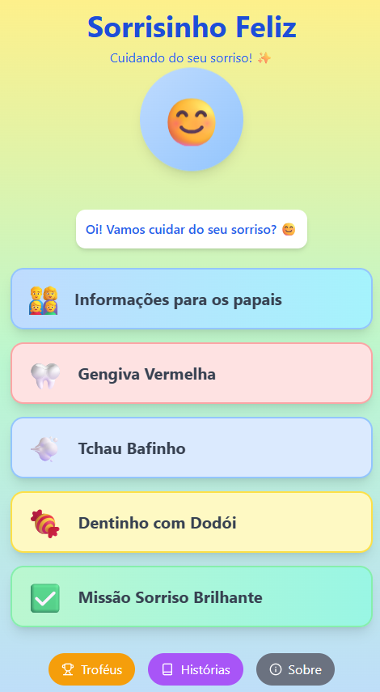

# ✨ Sorrisinho Feliz ✨

<p align="center"></p>

## 🚀 Deploy

Acesse a versão de produção do aplicativo através do link:

**[sorrisinhofeliz.vercel.app](https://sorrisinhofeliz.vercel.app/)**

---

## 📖 Sobre o Projeto

**Sorrisinho Feliz** é um aplicativo web educacional e interativo, desenvolvido como um projeto acadêmico, com o objetivo de ensinar crianças sobre a importância da saúde bucal de uma forma lúdica e divertida. O aplicativo aborda sintomas comuns como gengivite, halitose e cáries, oferecendo guias de escovação passo a passo e um robusto sistema de gamificação para engajar os pequenos.

---

## 🚀 Funcionalidades Principais

* **Guias de Escovação Interativos:** Tutoriais passo a passo e com cronômetro para diferentes necessidades (Gengivite, Halitose, Cárie).
* **Sistema de Gamificação e Recompensas:** A "Missão Sorriso Brilhante" incentiva a conclusão de tarefas diárias de higiene. Medalhas são concedidas por categoria e podem ser visualizadas em uma "Sala de Troféus" com calendários de conquista.
* **Histórias Desbloqueáveis:** Histórias infantis sobre saúde bucal são liberadas conforme a criança conquista mais medalhas, incentivando o progresso contínuo.
* **Área para os Pais:** Uma seção com informações técnicas sobre cada condição, ajudando os pais a entenderem os problemas e quando procurar um dentista.
* **PWA (Progressive Web App):** Pode ser instalado em dispositivos móveis como um aplicativo nativo.
* **Design Lúdico e Amigável:** Interface colorida, com emojis e uma linguagem simples para engajar o público infantil.

---

## � Estrutura do Projeto

O projeto é organizado com uma estrutura clara para facilitar a manutenção e o desenvolvimento de novas funcionalidades.

```
/
├── src/
│   ├── assets/         # Imagens, vídeos e outros arquivos estáticos
│   ├── components/     # Componentes React que representam cada tela da aplicação:
│   │   ├── AboutScreen.tsx         - Tela "Sobre", com informações do projeto e autores.
│   │   ├── BrushingGuideScreen.tsx - Guia de escovação interativo para um sintoma.
│   │   ├── ChecklistScreen.tsx     - Tela da "Missão Sorriso Brilhante" (checklist).
│   │   ├── HomeScreen.tsx          - Tela inicial do aplicativo.
│   │   ├── MedalHallScreen.tsx     - "Sala de Troféus" que exibe as medalhas.
│   │   ├── ParentsScreen.tsx       - Tela com informações detalhadas para os pais.
│   │   ├── StoriesScreen.tsx       - Tela de historinhas desbloqueáveis.
│   │   ├── SymptomScreen.tsx       - Tela que descreve um sintoma (cárie, etc.).
│   │   └── VideoModal.tsx          - Modal para exibir vídeos tutoriais.
│   ├── App.tsx         # Componente principal que gerencia o estado e a navegação
│   ├── data.ts         # Dados estáticos (textos, sintomas, missões, etc.)
│   └── main.tsx        # Ponto de entrada da aplicação React
├── public/             # Arquivos públicos que são copiados para a build
├── package.json
└── vite.config.ts
```

---

## �🛠️ Tecnologias Utilizadas

Este projeto foi construído com tecnologias modernas de desenvolvimento front-end:

* **[React](https://react.dev/)**: Biblioteca para construir interfaces de usuário.
* **[Vite](https://vitejs.dev/)**: Ferramenta de build moderna e ultrarrápida para desenvolvimento front-end.
* **[TypeScript](https://www.typescriptlang.org/)**: Superset do JavaScript que adiciona tipagem estática.
* **[Tailwind CSS](https://tailwindcss.com/)**: Framework CSS utility-first para estilização rápida e responsiva.
* **[Lucide React](https://lucide.dev/)**: Biblioteca de ícones SVG leves e consistentes.
* **[Vite PWA](https://vite-pwa-org.netlify.app/)**: Plugin para transformar o site em um Progressive Web App.

---

## ⚙️ Como Executar o Projeto Localmente

Para rodar o projeto na sua máquina, siga os passos abaixo:

1.  **Clone o repositório:**
    ```bash
    git clone https://github.com/adsoftware73-crypto/SorrisinhoFelizApp.git
    ```

2.  **Acesse a pasta do projeto:**
    ```bash
    cd sorrisinho-feliz-app
    ```

3.  **Instale as dependências:**
    ```bash
    npm install
    ```

4.  **Inicie o servidor de desenvolvimento:**
    ```bash
    npm run dev
    ```

5.  Abra [http://localhost:5173](http://localhost:5173) no seu navegador para ver o aplicativo.

---

## 👥 Autores e Orientadores

Este projeto foi desenvolvido com a dedicação dos seguintes discentes:

*   Anita Beatriz Barbosa Santos
*   Francisco Antônio Santana de Melo
*   João Vitor Lins
*   José Elerson Porto Costa
*   Letícia Thicyanne Melo Godoy Sousa
*   Marina Gomes da Silva

Sob a orientação das docentes:

*   Emily Feitosa Rêgo
*   Isabelly Eduarda Avelino

Agradecemos a todos pelo empenho e colaboração!
